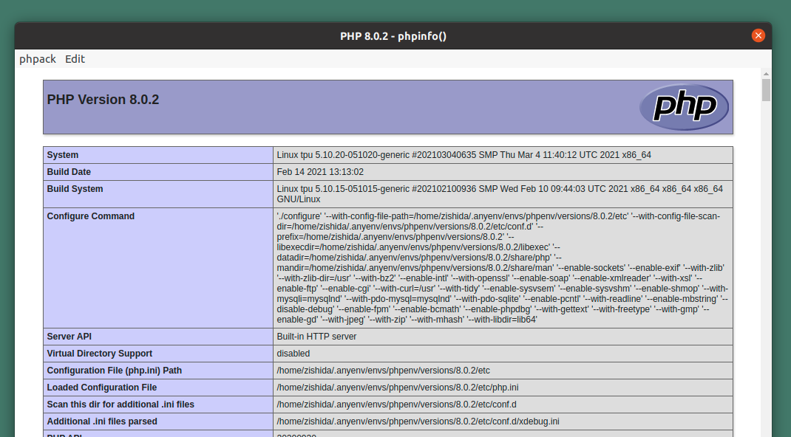

# phpack

pack php app to osx/linux app.



# install

```
$ npm ci
```

# edit your app

```
vi public/index.php
```

# test

```
$ npm run open
```

# pack

```
$ npm run pack

# osx
$ cp phpack-darwin-x64/phpack.app /path/to/anywhere/myGrateApp.app
$ cd /path/to/anywhere/
$ open myGrateApp.app

# linux
$ cp phpack-linux-x64/ /path/to/anywhere/phpack-your-app
$ cd /path/to/anywhere/phpack-your-app
$ phpack-your-app/phpack
```
